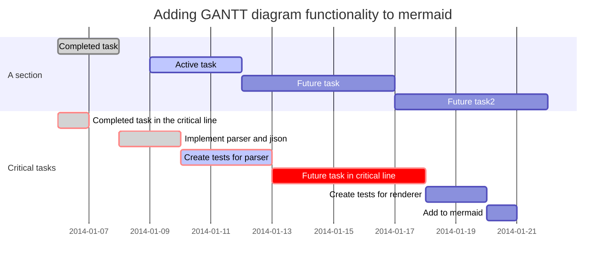

# pandoc-mermaid-filter

Fork from https://github.com/timofurrer/pandoc-mermaid-filter

Pandoc filter which converts mermaid code blocks to mermaid images.

!changed to work on windows and to have a higher default resolution when converting to latex

````


````

## Usage

Install it with setup.py:

in the current directory

```powershell
python -m pip install .
```

The mermaid binary must be in your `$PATH` or can be set with the
`MERMAID_BIN` environment variable.

By setting the environment variable `PUPPETEER_CFG`, you can pass a custom
configuration file to `mermaid` (`-p` option).

To setup the environment variables I would recommend using a python virtual environment. In the environments Scrips/Activation.ps1 add the following line,

```powershell
$env:MERMAID_BIN = "path to mmdc"
```

## But there is ...

There are a few other filters trying to convert mermaid code blocks however
they all failed for me.

### Troubleshoot

I've had to install the mermaid CLI locally instead of globally. See https://github.com/mermaidjs/mermaid.cli/issues/16
